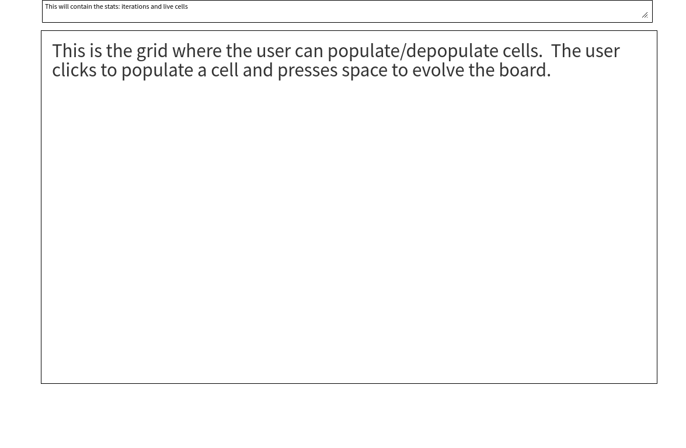
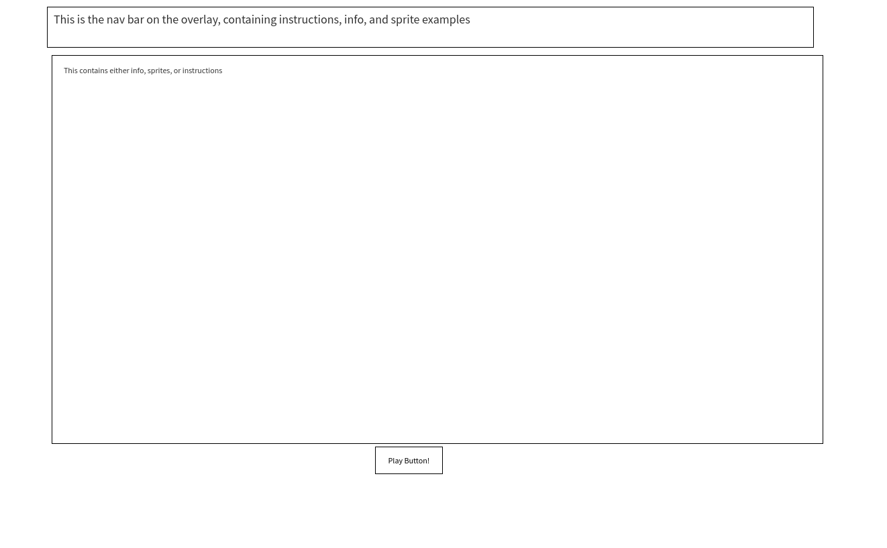

User Stories:
	1. Game is loaded, overlay is presented with a brief description of the rules
	2. User can check out information on the game of life by clicking through the navbar
	3. The info tab displays more information about the Game Of Life, and links to resources
	4. The sprites tab includes example sprites the user can attempt to construct
	5. The user presses the play button to bring up the play area
	6. The user clicks and moves the mouse to populate squares 
	7. The user presses space to evolve the board
	8. The user can press $ to enter 'rave' mode, this simply changes the color of elements on the page 
	9. The user can see how many iterations have passed in the stats bar, along with the number of livecells

